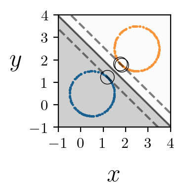

# Motivation
An iterative algorithm that makes use of elementary geometry to find the maximal margin hyperplane between two classes.

- provides weight and bias that defines the optimum-hyperplane and also gives the support vectors.
- applicable only for linearly separable problem. i.e., not for soft-marging
- if the data is not separable, the algorithm quickly figure out and stop further iterations. 
- currently support binary classification of labelled data with number of features greater than 1.

