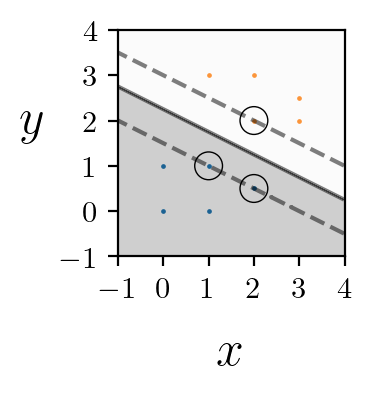
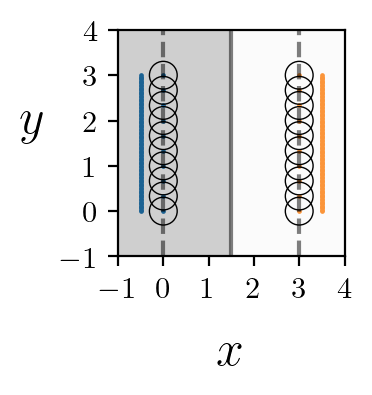
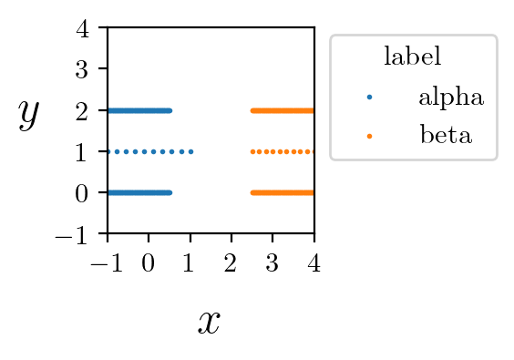
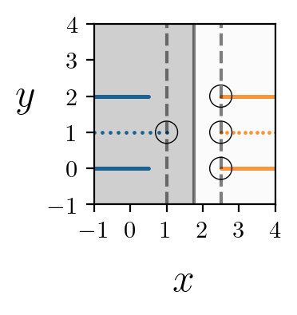

## Sample output
A few easy-to-understand minimal datasets are provided in the directory `data` to test and verify the package easily. One can run `main.py` and reproduce the below plots. 

#### sparse 

Success! Optimal hyperplane found.  
width = 1.3416407865  
support_vectors [[2.  2. ]
 [1.  1. ]
 [2.  0.5]]
 
 
 ---
 
#### circles  
Success! Optimal hyperplane found.  
width = 0.829257674385  
support_vectors [[1.77114039 1.81533682]
 [1.18890795 1.22484884]
 [1.82842003 1.75906793]]
 
 
---

#### lines  
Success! Optimal hyperplane found.  
width = 3.0  
support_vectors [[3.         2.33333333]
 [0.         1.33333333]
 [3.         0.        ]
 [3.         2.        ]
 [0.         2.        ]
 [0.         1.        ]
 [0.         2.33333333]
 [0.         2.66666667]
 [3.         1.        ]
 [3.         2.66666667]
 [3.         1.33333333]
 [0.         0.33333333]
 [0.         0.        ]
 [3.         0.66666667]
 [0.         1.66666667]
 [0.         0.66666667]
 [0.         3.        ]
 [3.         3.        ]
 [3.         1.66666667]
 [3.         0.33333333]]
 
 
---

#### lines_horz  
Success! Optimal hyperplane found.  
width = 1.5  
support_vectors [[2.5 1. ]
 [1.  1. ]
 [2.5 2. ]
 [2.5 0. ]]
 
 
---

#### circles_nonsep

Fail! Non-separable data.
 

---

#### clouds 
Success! Optimal hyperplane found.  
width = 1.454468266377  
support_vectors [[ 0.45955342  0.45724417  0.3057693 ]
 [-0.30359074 -0.40954113 -0.57840951]]
 

---
